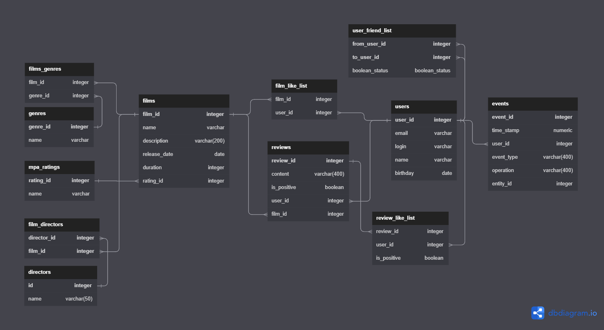

# java-filmorate

Технологии и инструменты:
Spring Boot, Lombok, Maven, REST, H2, GIT , jdbcTemplate.

ER диаграмма

Ссылка на ER модель базы данных программы: https://dbdiagram.io/d/64a45f7c02bd1c4a5e7ec08a

Приложение по оценке рейтинга фильмов.
В этом приложении можно добавлять фильмы и их оценивать лаком или дизлайком и исходя из этого у фильма вычисляется
рейтинг,искать фильмы по различным фильтрам, искать друзей по предпочтениям,оставлять комментарии к фильму.

приложение было созданно как групавой проект 
в неём принимали участие :
julia-gerasimenko - https://github.com/julia-gerasimenko
CheTigor - https://github.com/CheTigor/CheTigor
marina52746 - https://github.com/marina52746
gandistip - https://github.com/gandistip